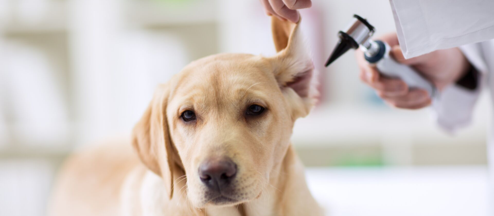
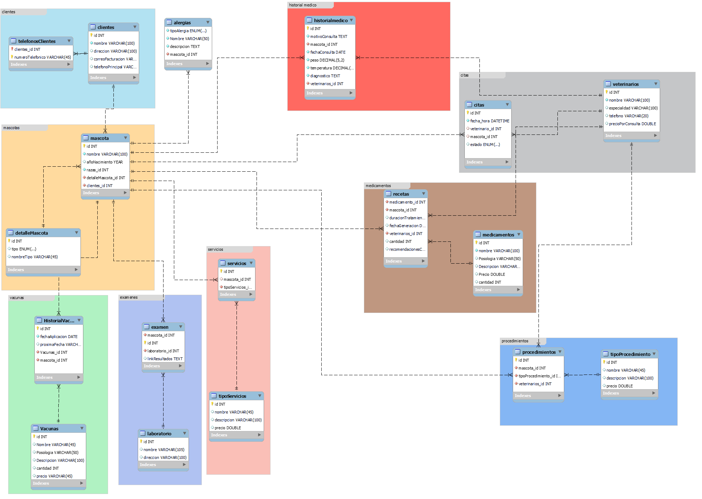
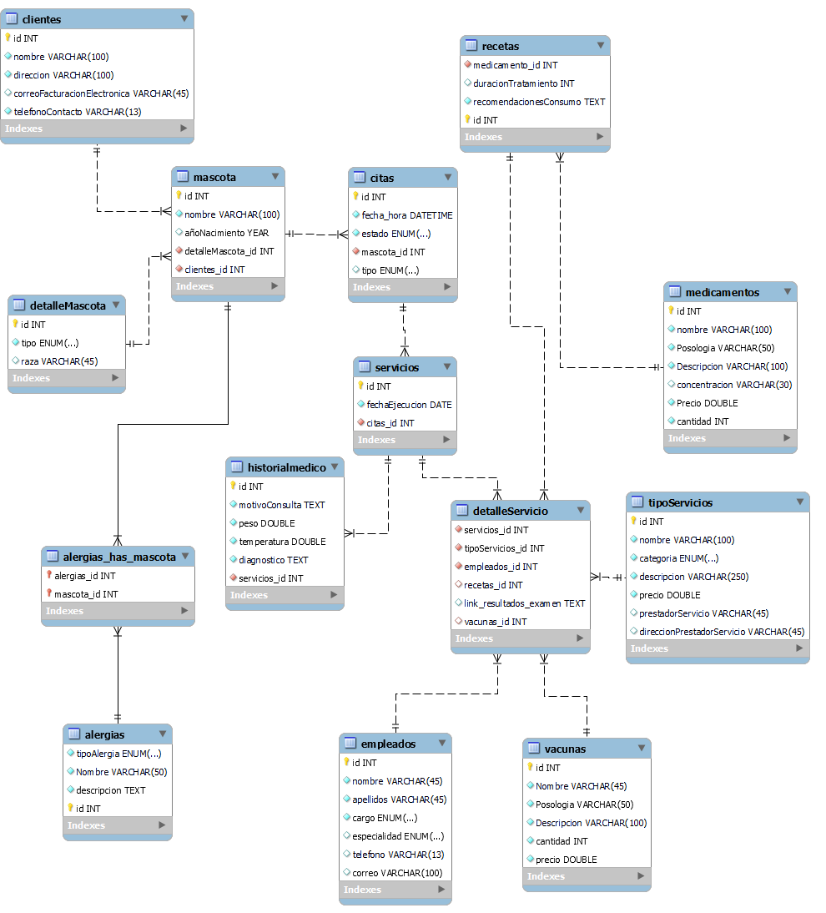

# **SISTEMA INTEGRAL DE DATOS VETERINARIA**

La señora Sandra administra con dedicación y amor su veterinaria"Mi Primera Mascotica" la cual se encuentra ubicada en Calle 10 Norte #11-29 de la ciudad de bucaramanga, esta veterinaria unicamente se especializa en la atención estetica e higienica de animales y prestación de servicios vaterios para especies tales como: Perros, gatos, hamsters, aves domesticas y peces. Este espacio ofrece una amplia gama de servicios, que van desde consultas de medicina general y especializada hasta un completo spa para mascotas, que incluye peluquería adaptada a todas las razas y tamaños, cortes de uñas, tratamientos capilares, masajes antiestrés, entre otros.

En "Mi Primera Máscotica," también se brindan terapias de movilidad, servicios de vacunación, toma de exámenes con análisis llevados a cabo por un laboratorio externo, así como procedimientos quirúrgicos como castraciones, y otros procedimientos que son comunmente requeridos por las mascoticas.

Con el objetivo de ofrecer un servicio más personalizado y estrechar la relación con los clientes, se recopila información esencial sobre cada mascota, como alergias, raza, especie, fecha de nacimiento y nombre.

Para simplificar el proceso de facturación y garantizar un pago eficiente por parte de los dueños, se solicitan los datos más relevantes, incluidos los de contacto y, en caso de preferencia, el correo electrónico para el envío de facturación electrónica.

Y como plus manejamos una historia clinica para que el cliente se fidelice y sepa que procedimientos ha tenido su mascota dentro de esta veterinaria

Con una visión integral que abarca desde cuidados médicos hasta productos esenciales, "Mi Primera Máscotica" se consolida como el lugar ideal para el bienestar y la felicidad de las mascotas en el norte de Bucaramanga.

## **Servicios que presta la Veterinaria**

- Corte y cepillado perro raza pequeña
- Corte y cepillado perro raza mediana
- Corte y cepillado perro raza grande
- Corte y cepillado gato raza pequeña
- Corte y cepillado gato raza mediana
- Corte y cepillado gato raza grande
- Corte y cepillado hamster
- Corte y cepillado aves domesticas
- Corte estilizado y cepillado perro raza pequeña
- Corte estilizado y cepillado perro raza mediana
- Corte estilizado y cepillado perro raza grande
- Corte estilizado y cepillado gato raza pequeña
- Corte estilizado y cepillado gato raza mediana
- Corte estilizado y cepillado gato raza grande
- Corte estilizado y cepillado hamster
- Corte estilizado y cepillado aves domesticas
- Baño y cepillado perro raza pequeña
- Baño y cepillado perro raza mediana
- Baño y cepillado perro raza grande
- Baño y cepillado gato raza pequeña
- Baño y cepillado gato raza mediana
- Baño y cepillado gato raza grande
- Baño y cepillado hamster
- Baño y cepillado aves domesticas
- Tratamiento de cabello perro raza pequeña
- Tratamiento de cabello perro raza mediana
- Tratamiento de cabello perro raza grande
- Tratamiento de cabello gato raza pequeña
- Tratamiento de cabello gato raza mediana
- Tratamiento de cabello gato raza grande
- Tratamiento de cabello hamster
- Tratamiento de cabello aves domesticas
- Corte de uñas perro raza pequeña
- Corte de uñas perro raza mediana
- Corte de uñas perro raza grande
- Corte de uñas gato raza pequeña
- Corte de uñas gato raza mediana
- Corte de uñas gato raza grande
- Corte de uñas hamster
- Corte de uñas aves domesticas
- Higiene bucal perro raza pequeña
- Higiene bucal perro raza mediana
- Higiene bucal perro raza grande
- Higiene bucal gato raza pequeña
- Higiene bucal gato raza mediana
- Higiene bucal gato raza grande
- Higiene bucal hamster
- Higiene bucal aves domesticas
- Tratamientos capilares perro raza pequeña
- Tratamientos capilares perro raza mediana
- Tratamientos capilares perro raza grande
- Tratamientos capilares gato raza pequeña
- Tratamientos capilares gato raza mediana
- Tratamientos capilares gato raza grande
- Tratamientos capilares hamster
- Tratamientos capilares aves domesticas
- Eliminación de pulgas y garrapatas perro raza pequeña
- Eliminación de pulgas y garrapatas perro raza mediana
- Eliminación de pulgas y garrapatas perro raza grande
- Eliminación de pulgas y garrapatas gato raza pequeña
- Eliminación de pulgas y garrapatas gato raza mediana
- Eliminación de pulgas y garrapatas gato raza grande
- Masajes y terapias antiestrés perro raza pequeña
- Masajes y terapias antiestrés perro raza mediana
- Masajes y terapias antiestrés perro raza grande
- Masajes y terapias antiestrés gato raza pequeña
- Masajes y terapias antiestrés gato raza mediana
- Masajes y terapias antiestrés gato raza grande
- Tintes y decoraciones perro raza pequeña
- Tintes y decoraciones perro raza mediana
- Tintes y decoraciones perro raza grande
- Tintes y decoraciones gato raza pequeña
- Tintes y decoraciones gato raza mediana
- Tintes y decoraciones gato raza grande
- Tintes y decoraciones aves domesticas
- Servicios de spa perro raza pequeña
- Servicios de spa perro raza mediana
- Servicios de spa perro raza grande
- Servicios de spa gato raza pequeña
- Servicios de spa gato raza mediana
- Servicios de spa gato raza grande
- Servicios de spa hamster
- Servicios de spa aves domesticas
- Cuidado de oídos y ojos perro raza pequeña
- Cuidado de oídos y ojos perro raza mediana
- Cuidado de oídos y ojos perro raza grande
- Cuidado de oídos y ojos gato raza pequeña
- Cuidado de oídos y ojos gato raza mediana
- Cuidado de oídos y ojos gato raza grande
- Cuidado de oídos y ojos hamster
- Cuidado de oídos y ojos aves domesticas
- Cortes de uñas y almohadillas perro raza pequeña
- Cortes de uñas y almohadillas perro raza mediana
- Cortes de uñas y almohadillas perro raza grande
- Cortes de uñas y almohadillas gato raza pequeña
- Cortes de uñas y almohadillas gato raza mediana
- Cortes de uñas y almohadillas gato raza grande
- Vacunacion perro
- Vacunacion gato
- Vacunacion hamster
- Vacunacion aves domesticas
- Desparasitación perro
- Desparasitación gato
- Desparasitación aves domesticas
- Desparasitación hamster
- Servicios de laboratorios perro
- Servicios de laboratorios gato
- Servicios de laboratorios hamster
- Servicios de laboratorios aves domesticas
- Servicio fisioterapia perro
- Servicio fisioterapia gato
- Servicio fisioterapia hamster
- Servicio fsioterapia aves domesticas
- Esterilización perro
- Esterilización gato
- Esterilización hembra perro
- Esterilización hembra gato
- Cirugía de Tejidos Blandos perro
- Cirugía de Tejidos Blandos gato
- Cirugía de Tejidos Blandos aves domésticas
- Cirugía de Tejidos Blandos hámster
- Cirugía Ortopédica perro
- Cirugía Ortopédica gato
- Cirugía de Cabeza y Cuello perro
- Cirugía de Cabeza y Cuello gato
- Cirugía Gastrointestinal perro
- Cirugía Gastrointestinal gato
- Cirugía Cardiovascular perro
- Cirugía Cardiovascular gato
- Cirugía Ocular perro
- Cirugía Ocular gato
- Cirugía Ocular aves doméstica
- Cirugía Reconstructiva perro
- Cirugía Reconstructiva gato
- Cirugía Reconstructiva aves domésticas
- Cirugía Dental perro
- Cirugía Dental gato
- Cirugía Abdominal perro
- Cirugía Abdominal gato
- Cirugía de Emergencia perro
- Cirugía de Emergencia gato
- Cirugía de Emergencia aves domésticas
- Cirugía de Alas y Plumaje aves domésticas
- Cirugía de Patas y Garras perro
- Cirugía de Patas y Garras gato
- Cirugía de Patas y Garras ave domestica
- Cirugía de Pico aves domésticas
- Consulta para Aves Domésticas
- Consulta para Aves Perros
- Consulta para gatos
- Consulta para hamsters
- Consulta para peces

## **Modelo Conceptual**

1. Se necesita una lista de clientes que incluya sus nombres, direccion, número de teléfono y correos electrónicos para la facturación.
2. Para las mascotas, se requiere un espacio para registrar el nombre, especie, raza, edad y alergias, crucial para evitar errores en medicamentos o procedimientos.
3. Se necesita un sistema para agendar citas para algunos de los servicios.
4. Es esencial tener información completa sobre veterinarios, auxiliares, esteticistas, incluyendo nombres, especialidades y los datos necesarios para manejar bien los empleados de esta veterinaria.
5. Debe existir una lista de medicamentos y sus cantidades disponibles para atender las necesidades de las mascotas.
6. Si un veterinario receta medicamentos, es necesario registrar el medicamento, la fecha de la receta, duración del tratamiento, cantidades y recomendaciones de consumo.
7. Se necesita un registro de las vacunas que brindamos en el servicio de vacunacion.
8. Se debe registrar cualquier procedimiento realizado en las mascotas.
9. Un registro de laboratorios externos a los que se envían pruebas, incluyendo tipo de examen, laboratorio y resultados.
10. Es necesario llevar un registro de servicios como baños o cortes de pelo.
11. Para mantener un registro completo del negocio, se requiere un registro de precios de medicamentos, procedimientos, consultas, servicios esteticos y vacunaciones.
12. En resumen, se necesita un sistema que mantenga todo organizado y accesible, permitiendo un fácil acceso a la información de cada mascota cuando sea necesario, asegurando así la atención adecuada.

## **Modelo antes de normalizacion**

## **Modelo normalizado**

## **Modelo logico**

### **`vacunas`**

- Atributos:
  - `id` (PK): Identificador único de la vacuna.
  - `Nombre`: Nombre de la vacuna.
  - `Posologia`: Posología de la vacuna.
  - `Descripcion`: Descripción de la vacuna.
  - `cantidad`: Cantidad disponible de la vacuna.
  - `precio`: Precio de la vacuna.

### **`tipoServicios`**

- Atributos:
  - `id` (PK): Identificador único del tipo de servicio.
  - `nombre`: Nombre del tipo de servicio.
  - `categoria`: Categoría del servicio (Laboratorios, Vacunacion, Estetica, Consultas, Quirurgicos).
  - `descripcion`: Descripción del tipo de servicio.
  - `precio`: Precio del servicio.
  - `prestadorServicio`: Nombre del prestador de servicios (opcional).
  - `direccionPrestadorServicio`: Dirección del prestador de servicios (opcional).

### **`detalleMascota`**

- Atributos:
  - `id` (PK): Identificador único del detalle de la mascota.
  - `tipo`: Tipo de mascota (perro, gato, ave, hamster, pez).
  - `raza`: Raza de la mascota (opcional).

### **`empleados`**

- Atributos:
  - `id` (PK): Identificador único del empleado.
  - `nombre`: Nombre del empleado.
  - `apellidos`: Apellidos del empleado.
  - `cargo`: Cargo del empleado (Veterinario, Auxiliar, Esteticista).
  - `especialidad`: Especialidad del empleado (opcional).
  - `telefono`: Número de teléfono del empleado (opcional).
  - `correo`: Dirección de correo electrónico del empleado (opcional).

### **`clientes`**

- Atributos:
  - `id` (PK): Identificador único del cliente.
  - `nombre`: Nombre del cliente.
  - `direccion`: Dirección del cliente.
  - `correoFacturacionElectronica`: Correo electrónico para facturación electrónica (opcional).
  - `telefonoContacto`: Número de teléfono de contacto del cliente.

### **`alergias`**

- Atributos:
  - `tipoAlergia`: Tipo de alergia (Alimentaria, Ambiental, Insectos, Medicamentos, Materiales, Contacto).
  - `Nombre`: Nombre de la alergia.
  - `descripcion`: Descripción de la alergia.
  - `id` (PK): Identificador único de la alergia.

### **`medicamentos`**

- Atributos:
  - `id` (PK): Identificador único del medicamento.
  - `nombre`: Nombre del medicamento.
  - `Posologia`: Posología del medicamento.
  - `Descripcion`: Descripción del medicamento.
  - `concentracion`: Concentración del medicamento.
  - `Precio`: Precio del medicamento.
  - `cantidad`: Cantidad disponible del medicamento.

### **`mascota`**

- Atributos:
  - `id` (PK): Identificador único de la mascota.
  - `nombre`: Nombre de la mascota.
  - `añoNacimiento`: Año de nacimiento de la mascota.
  - `detalleMascota_id`: Referencia al detalle de la mascota.
  - `clientes_id`: Referencia al cliente propietario de la mascota.

### **`alergias_has_mascota`**

- Atributos:
  - `alergias_id` (PK, FK): Referencia a la alergia.
  - `mascota_id` (PK, FK): Referencia a la mascota.

### **`citas`**

- Atributos:
  - `id` (PK): Identificador único de la cita.
  - `fecha_hora`: Fecha y hora de la cita.
  - `estado`: Estado de la cita (completada, cancelada, pendiente).
  - `mascota_id` (FK): Referencia a la mascota.
  - `tipo`: Tipo de cita (prioritaria, comun).

### **`servicios`**

- Atributos:
  - `id` (PK): Identificador único del servicio.
  - `fechaEjecucion`: Fecha de ejecución del servicio.
  - `citas_id` (FK): Referencia a la cita asociada al servicio.

### **`historialmedico`**

- Atributos:
  - `id` (PK): Identificador único del historial médico.
  - `motivoConsulta`: Motivo de la consulta.
  - `peso`: Peso del paciente.
  - `temperatura`: Temperatura del paciente.
  - `diagnostico`: Diagnóstico del paciente.
  - `servicios_id` (FK): Referencia al servicio asociado al historial médico.

### **`recetas`**

- Atributos:
  - `medicamento_id` (PK, FK): Referencia al medicamento en la receta.
  - `duracionTratamiento`: Duración del tratamiento.
  - `recomendacionesConsumo`: Recomendaciones de consumo.
  - `id` (PK): Identificador único de la receta.

### **`detalleServicio`**

- Atributos:
  - `servicios_id` (PK, FK): Referencia al servicio asociado.
  - `tipoServicios_id` (FK): Referencia al tipo de servicio asociado.
  - `empleados_id` (FK): Referencia al empleado asociado.
  - `recetas_id` (FK): Referencia a la receta asociada (opcional).
  - `link_resultados_examen`: Enlace a los resultados del examen (opcional).
  - `vacunas_id` (FK): Referencia a la vacuna asociada (opcional).