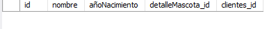

# **SISTEMA INTEGRAL DE DATOS VETERINARIA**


La señora Sandra administra con dedicación y amor su veterinaria"Mi Primera Mascotica" la cual se encuentra ubicada en Calle 10 Norte #11-29 de la ciudad de bucaramanga, esta veterinaria unicamente se especializa en la atención estetica e higienica de animales y prestación de servicios vaterios para especies tales como: Perros, gatos, hamsters, aves domesticas y peces. Este espacio ofrece una amplia gama de servicios, que van desde consultas de medicina general y especializada hasta un completo spa para mascotas, que incluye peluquería adaptada a todas las razas y tamaños, cortes de uñas, tratamientos capilares, masajes antiestrés, entre otros.

En "Mi Primera Máscotica," también se brindan terapias de movilidad, servicios de vacunación, toma de exámenes con análisis llevados a cabo por un laboratorio externo, así como procedimientos quirúrgicos como castraciones, y otros procedimientos que son comunmente requeridos por las mascoticas.

Con el objetivo de ofrecer un servicio más personalizado y estrechar la relación con los clientes, se recopila información esencial sobre cada mascota, como alergias, raza, especie, fecha de nacimiento y nombre.

Para simplificar el proceso de facturación y garantizar un pago eficiente por parte de los dueños, se solicitan los datos más relevantes, incluidos los de contacto y, en caso de preferencia, el correo electrónico para el envío de facturación electrónica.

Y como plus manejamos una historia clinica para que el cliente se fidelice y sepa que procedimientos ha tenido su mascota dentro de esta veterinaria

Con una visión integral que abarca desde cuidados médicos hasta productos esenciales, "Mi Primera Máscotica" se consolida como el lugar ideal para el bienestar y la felicidad de las mascotas en el norte de Bucaramanga.


## **SERVICIOS PRESTADOS POR VETERINARIA**

- Corte y cepillado perro raza pequeña
- Corte y cepillado perro raza mediana
- Corte y cepillado perro raza grande
- Corte y cepillado gato raza pequeña
- Corte y cepillado gato raza mediana
- Corte y cepillado gato raza grande
- Corte y cepillado hamster
- Corte y cepillado aves domesticas
- Corte estilizado y cepillado perro raza pequeña
- Corte estilizado y cepillado perro raza mediana
- Corte estilizado y cepillado perro raza grande
- Corte estilizado y cepillado gato raza pequeña
- Corte estilizado y cepillado gato raza mediana
- Corte estilizado y cepillado gato raza grande
- Corte estilizado y cepillado hamster
- Corte estilizado y cepillado aves domesticas
- Baño y cepillado perro raza pequeña
- Baño y cepillado perro raza mediana
- Baño y cepillado perro raza grande
- Baño y cepillado gato raza pequeña
- Baño y cepillado gato raza mediana
- Baño y cepillado gato raza grande
- Baño y cepillado hamster
- Baño y cepillado aves domesticas
- Tratamiento de cabello perro raza pequeña
- Tratamiento de cabello perro raza mediana
- Tratamiento de cabello perro raza grande
- Tratamiento de cabello gato raza pequeña
- Tratamiento de cabello gato raza mediana
- Tratamiento de cabello gato raza grande
- Tratamiento de cabello hamster
- Tratamiento de cabello aves domesticas
- Corte de uñas perro raza pequeña
- Corte de uñas perro raza mediana
- Corte de uñas perro raza grande
- Corte de uñas gato raza pequeña
- Corte de uñas gato raza mediana
- Corte de uñas gato raza grande
- Corte de uñas hamster
- Corte de uñas aves domesticas
- Higiene bucal perro raza pequeña
- Higiene bucal perro raza mediana
- Higiene bucal perro raza grande
- Higiene bucal gato raza pequeña
- Higiene bucal gato raza mediana
- Higiene bucal gato raza grande
- Higiene bucal hamster
- Higiene bucal aves domesticas
- Tratamientos capilares perro raza pequeña
- Tratamientos capilares perro raza mediana
- Tratamientos capilares perro raza grande
- Tratamientos capilares gato raza pequeña
- Tratamientos capilares gato raza mediana
- Tratamientos capilares gato raza grande
- Tratamientos capilares hamster
- Tratamientos capilares aves domesticas
- Eliminación de pulgas y garrapatas perro raza pequeña
- Eliminación de pulgas y garrapatas perro raza mediana
- Eliminación de pulgas y garrapatas perro raza grande
- Eliminación de pulgas y garrapatas gato raza pequeña
- Eliminación de pulgas y garrapatas gato raza mediana
- Eliminación de pulgas y garrapatas gato raza grande
- Masajes y terapias antiestrés perro raza pequeña
- Masajes y terapias antiestrés perro raza mediana
- Masajes y terapias antiestrés perro raza grande
- Masajes y terapias antiestrés gato raza pequeña
- Masajes y terapias antiestrés gato raza mediana
- Masajes y terapias antiestrés gato raza grande
- Tintes y decoraciones perro raza pequeña
- Tintes y decoraciones perro raza mediana
- Tintes y decoraciones perro raza grande
- Tintes y decoraciones gato raza pequeña
- Tintes y decoraciones gato raza mediana
- Tintes y decoraciones gato raza grande
- Tintes y decoraciones aves domesticas
- Servicios de spa perro raza pequeña
- Servicios de spa perro raza mediana
- Servicios de spa perro raza grande
- Servicios de spa gato raza pequeña
- Servicios de spa gato raza mediana
- Servicios de spa gato raza grande
- Servicios de spa hamster
- Servicios de spa aves domesticas
- Cuidado de oídos y ojos perro raza pequeña
- Cuidado de oídos y ojos perro raza mediana
- Cuidado de oídos y ojos perro raza grande
- Cuidado de oídos y ojos gato raza pequeña
- Cuidado de oídos y ojos gato raza mediana
- Cuidado de oídos y ojos gato raza grande
- Cuidado de oídos y ojos hamster
- Cuidado de oídos y ojos aves domesticas
- Cortes de uñas y almohadillas perro raza pequeña
- Cortes de uñas y almohadillas perro raza mediana
- Cortes de uñas y almohadillas perro raza grande
- Cortes de uñas y almohadillas gato raza pequeña
- Cortes de uñas y almohadillas gato raza mediana
- Cortes de uñas y almohadillas gato raza grande
- Vacunacion perro
- Vacunacion gato
- Vacunacion hamster
- Vacunacion aves domesticas
- Desparasitación perro
- Desparasitación gato
- Desparasitación aves domesticas
- Desparasitación hamster
- Servicios de laboratorios perro
- Servicios de laboratorios gato
- Servicios de laboratorios hamster
- Servicios de laboratorios aves domesticas
- Servicio fisioterapia perro
- Servicio fisioterapia gato
- Servicio fisioterapia hamster
- Servicio fsioterapia aves domesticas
- Esterilización perro
- Esterilización gato
- Esterilización hembra perro
- Esterilización hembra gato
- Cirugía de Tejidos Blandos perro
- Cirugía de Tejidos Blandos gato
- Cirugía de Tejidos Blandos aves domésticas
- Cirugía de Tejidos Blandos hámster
- Cirugía Ortopédica perro
- Cirugía Ortopédica gato
- Cirugía de Cabeza y Cuello perro
- Cirugía de Cabeza y Cuello gato
- Cirugía Gastrointestinal perro
- Cirugía Gastrointestinal gato
- Cirugía Cardiovascular perro
- Cirugía Cardiovascular gato
- Cirugía Ocular perro
- Cirugía Ocular gato
- Cirugía Ocular aves doméstica
- Cirugía Reconstructiva perro
- Cirugía Reconstructiva gato
- Cirugía Reconstructiva aves domésticas
- Cirugía Dental perro
- Cirugía Dental gato
- Cirugía Abdominal perro
- Cirugía Abdominal gato
- Cirugía de Emergencia perro
- Cirugía de Emergencia gato
- Cirugía de Emergencia aves domésticas
- Cirugía de Alas y Plumaje aves domésticas
- Cirugía de Patas y Garras perro
- Cirugía de Patas y Garras gato
- Cirugía de Patas y Garras ave domestica
- Cirugía de Pico aves domésticas
- Consulta para Aves Domésticas
- Consulta para Aves Perros
- Consulta para gatos
- Consulta para hamsters
- Consulta para peces


## **MODELO CONCEPTUAL**

1. Se necesita una lista de clientes que incluya sus nombres, direccion, número de teléfono y correos electrónicos para la facturación.
2. Para las mascotas, se requiere un espacio para registrar el nombre, especie, raza, edad y alergias, crucial para evitar errores en medicamentos o procedimientos.
3. Se necesita un sistema para agendar citas para algunos de los servicios.
4. Es esencial tener información completa sobre veterinarios, auxiliares, esteticistas, incluyendo nombres, especialidades y los datos necesarios para manejar bien los empleados de esta veterinaria.
5. Debe existir una lista de medicamentos y sus cantidades disponibles para atender las necesidades de las mascotas.
6. Si un veterinario receta medicamentos, es necesario registrar el medicamento, la fecha de la receta, duración del tratamiento, cantidades y recomendaciones de consumo.
7. Se necesita un registro de las vacunas que brindamos en el servicio de vacunacion.
8. Se debe registrar cualquier procedimiento realizado en las mascotas.
9. Un registro de laboratorios externos a los que se envían pruebas, incluyendo tipo de examen, laboratorio y resultados.
10. Es necesario llevar un registro de servicios como baños o cortes de pelo.
11. Para mantener un registro completo del negocio, se requiere un registro de precios de medicamentos, procedimientos, consultas, servicios esteticos y vacunaciones.
12. En resumen, se necesita un sistema que mantenga todo organizado y accesible, permitiendo un fácil acceso a la información de cada mascota cuando sea necesario, asegurando así la atención adecuada.

## **MODELO ANTES DE NORMALIZACION**


## **MODELO NORMALIZADO**


## **MODELO LOGICO**

### **`vacunas`**

- Atributos:
  - `id` (PK): Identificador único de la vacuna.
  - `Nombre`: Nombre de la vacuna.
  - `Posologia`: Posología de la vacuna.
  - `Descripcion`: Descripción de la vacuna.
  - `cantidad`: Cantidad disponible de la vacuna.
  - `precio`: Precio de la vacuna.

### **`tipoServicios`**

- Atributos:
  - `id` (PK): Identificador único del tipo de servicio.
  - `nombre`: Nombre del tipo de servicio.
  - `categoria`: Categoría del servicio (Laboratorios, Vacunacion, Estetica, Consultas, Quirurgicos).
  - `descripcion`: Descripción del tipo de servicio.
  - `precio`: Precio del servicio.
  - `prestadorServicio`: Nombre del prestador de servicios (opcional).
  - `direccionPrestadorServicio`: Dirección del prestador de servicios (opcional).

### **`detalleMascota`**

- Atributos:
  - `id` (PK): Identificador único del detalle de la mascota.
  - `tipo`: Tipo de mascota (perro, gato, ave, hamster, pez).
  - `raza`: Raza de la mascota (opcional).

### **`empleados`**

- Atributos:
  - `id` (PK): Identificador único del empleado.
  - `nombre`: Nombre del empleado.
  - `apellidos`: Apellidos del empleado.
  - `cargo`: Cargo del empleado (Veterinario, Auxiliar, Esteticista).
  - `especialidad`: Especialidad del empleado (opcional).
  - `telefono`: Número de teléfono del empleado (opcional).
  - `correo`: Dirección de correo electrónico del empleado (opcional).

### **`clientes`**

- Atributos:
  - `id` (PK): Identificador único del cliente.
  - `nombre`: Nombre del cliente.
  - `direccion`: Dirección del cliente.
  - `correoFacturacionElectronica`: Correo electrónico para facturación electrónica (opcional).
  - `telefonoContacto`: Número de teléfono de contacto del cliente.

### **`alergias`**

- Atributos:
  - `tipoAlergia`: Tipo de alergia (Alimentaria, Ambiental, Insectos, Medicamentos, Materiales, Contacto).
  - `Nombre`: Nombre de la alergia.
  - `descripcion`: Descripción de la alergia.
  - `id` (PK): Identificador único de la alergia.

### **`medicamentos`**

- Atributos:
  - `id` (PK): Identificador único del medicamento.
  - `nombre`: Nombre del medicamento.
  - `Posologia`: Posología del medicamento.
  - `Descripcion`: Descripción del medicamento.
  - `concentracion`: Concentración del medicamento.
  - `Precio`: Precio del medicamento.
  - `cantidad`: Cantidad disponible del medicamento.

### **`mascota`**

- Atributos:
  - `id` (PK): Identificador único de la mascota.
  - `nombre`: Nombre de la mascota.
  - `añoNacimiento`: Año de nacimiento de la mascota.
  - `detalleMascota_id`: Referencia al detalle de la mascota.
  - `clientes_id`: Referencia al cliente propietario de la mascota.

### **`alergias_has_mascota`**

- Atributos:
  - `alergias_id` (PK, FK): Referencia a la alergia.
  - `mascota_id` (PK, FK): Referencia a la mascota.

### **`citas`**

- Atributos:
  - `id` (PK): Identificador único de la cita.
  - `fecha_hora`: Fecha y hora de la cita.
  - `estado`: Estado de la cita (completada, cancelada, pendiente).
  - `mascota_id` (FK): Referencia a la mascota.
  - `tipo`: Tipo de cita (prioritaria, comun).

### **`servicios`**

- Atributos:
  - `id` (PK): Identificador único del servicio.
  - `fechaEjecucion`: Fecha de ejecución del servicio.
  - `citas_id` (FK): Referencia a la cita asociada al servicio.

### **`historialmedico`**

- Atributos:
  - `id` (PK): Identificador único del historial médico.
  - `motivoConsulta`: Motivo de la consulta.
  - `peso`: Peso del paciente.
  - `temperatura`: Temperatura del paciente.
  - `diagnostico`: Diagnóstico del paciente.
  - `servicios_id` (FK): Referencia al servicio asociado al historial médico.

### **`recetas`**

- Atributos:
  - `medicamento_id` (PK, FK): Referencia al medicamento en la receta.
  - `duracionTratamiento`: Duración del tratamiento.
  - `recomendacionesConsumo`: Recomendaciones de consumo.
  - `id` (PK): Identificador único de la receta.

### **`detalleServicio`**

- Atributos:
  - `servicios_id` (PK, FK): Referencia al servicio asociado.
  - `tipoServicios_id` (FK): Referencia al tipo de servicio asociado.
  - `empleados_id` (FK): Referencia al empleado asociado.
  - `recetas_id` (FK): Referencia a la receta asociada (opcional).
  - `link_resultados_examen`: Enlace a los resultados del examen (opcional).
  - `vacunas_id` (FK): Referencia a la vacuna asociada (opcional).


## **CONSULTAS CRUD**

**Consultas tabla vacunas**
<details>
<summary>CRUD</summary>

Insertar una nueva vacuna:

```sql
INSERT INTO vacunas (Nombre, Posologia, Descripcion, cantidad, precio)
VALUES ('NuevaVacuna', 'PosologiaNueva', 'DescripcionNueva', 10, 19.99);
```

Leer todas las vacunas:

```sql
SELECT * FROM vacunas;
```

Actualizar una vacuna existente:

```sql
UPDATE vacunas
SET Nombre = 'VacunaActualizada', Posologia = 'PosologiaActualizada', Descripcion = 'DescripcionActualizada', cantidad = 15, precio = 24.99
WHERE id = 1;
```

Eliminar una vacuna:

```sql
DELETE FROM vacunas WHERE id = 1;
```
</details>

**Consultas tabla tipoServicios**
<details>
<summary>CRUD</summary>

Insertar una nueva tipoServicios:

```sql
INSERT INTO tipoServicios (nombre, categoria, descripcion, precio, prestadorServicio, direccionPrestadorServicio)
VALUES ('NuevoServicio', 'Estetica', 'DescripcionNueva', 49.99, 'PrestadorNuevo', 'DireccionNueva');
```

Leer todas los tipoServicios:

```sql
SELECT * FROM tipoServicios;
```

Actualizar un tipoServicio existente:

```sql
UPDATE tipoServicios
SET nombre = 'ServicioActualizado', categoria = 'Consultas', descripcion = 'DescripcionActualizada', precio = 59.99, prestadorServicio = 'NuevoPrestador', direccionPrestadorServicio = 'NuevaDireccion'
WHERE id = 1;
```

Eliminar un tipoServicio:

```sql
DELETE FROM tipoServicios WHERE id = 1;
```
</details>

**Consultas tabla detalleMascota**
<details>
<summary>CRUD</summary>
Insertar un nuevo detalleMascota:

```sql
INSERT INTO detalleMascota (id, tipo, raza)
VALUES (1, 'perro', 'Labrador');
```

Leer todos los detalleMascota:

```sql
SELECT * FROM detalleMascota;
```

Actualizar un detalleMascota existente:

```sql
UPDATE detalleMascota
SET tipo = 'gato', raza = 'Siames'
WHERE id = 1;
```

Eliminar un detalleMascota:

```sql
DELETE FROM detalleMascota WHERE id = 1;
```
</details>


**Consultas tabla empleados**
<details>
<summary>CRUD</summary>
Insertar un nuevo empleado:

```sql
INSERT INTO empleados (id, nombre, apellidos, cargo, especialidad, telefono, correo)
VALUES (1, 'NuevoEmpleado', 'ApellidosNuevo', 'Veterinario', 'General', '123456789', 'nuevoempleado@example.com');
```

Leer todos los empleados:

```sql
SELECT * FROM empleados;
```

Actualizar un empleado existente:

```sql
UPDATE empleados
SET nombre = 'NombreActualizado', apellidos = 'ApellidosActualizados', cargo = 'Esteticista', especialidad = 'Dermatología', telefono = '987654321', correo = 'empleadoactualizado@example.com'
WHERE id = 1;
```

Eliminar un empleado:

```sql
DELETE FROM empleados WHERE id = 1;
```
</details>


**Consultas tabla clientess**
<details>
<summary>CRUD</summary>

Insertar un nuevo cliente:

```sql
INSERT INTO clientes (id, nombre, direccion, correoFacturacionElectronica, telefonoContacto)
VALUES (16548652, 'NuevoCliente', 'DireccionCliente', 'cliente@example.com', '123456789');
```

Leer todos los clientes:

```sql
SELECT * FROM clientes;
```

Actualizar un cliente existente:

```sql
UPDATE clientes
SET nombre = 'NombreActualizado', direccion = 'DireccionActualizada', correoFacturacionElectronica = 'clienteactualizado@example.com', telefonoContacto = '987654321'
WHERE id = 1;
```

Eliminar un cliente:

```sql
DELETE FROM clientes WHERE id = 1;
```
</details>


**Consultas tabla alergias**

<details>
<summary>CRUD</summary>
Insertar una nueva alergia:

```sql
INSERT INTO alergias (tipoAlergia, Nombre, descripcion, id)
VALUES ('Alimentaria', 'NuevaAlergia', 'Descripción de la nueva alergia.', 1);
```

Leer todas las alergias:

```sql
SELECT * FROM alergias;
```

Actualizar una alergia:

```sql
UPDATE alergias
SET tipoAlergia = 'Insectos', Nombre = 'AlergiaActualizada', descripcion = 'Descripción actualizada de la alergia.'
WHERE id = 1;
```

Eliminar una alergia:

```sql
DELETE FROM alergias WHERE id = 1;
```
</details>


**Consultas tabla medicamentos**

<details>
<summary>CRUD</summary>
Insertar un medicamento :

```sql
INSERT INTO medicamentos (id, nombre, Posologia, Descripcion, concentracion, Precio, cantidad)
VALUES (1, 'NuevoMedicamento', 'PosologiaNueva', 'Descripción del nuevo medicamento.', 'ConcentracionNueva', 10.99, 50);
```

Leer todos los medicamentos:

```sql
SELECT * FROM medicamentos;
```

Actualizar un  medicamento:

```sql
UPDATE medicamentos 
SET nombre = 'nuevo_nombre', Posologia = 'nueva_Posologia', Descripcion = 'nueva_Descripcion', concentracion = 'nueva_concentracion', Precio = nuevo_precio, cantidad = nueva_cantidad 
WHERE id = id_existente;

```

Eliminar un medicamento:

```sql
DELETE FROM medicamentos WHERE id = 1;
```
</details>


**Consultas tabla mascotas**

<details>
<summary>CRUD</summary>
Insertar una mascota:

```sql
INSERT INTO mascota (id, nombre, añoNacimiento, detalleMascota_id, clientes_id)
VALUES (1, 'NuevaMascota', 2020, 1, 1);
```

Leer todas las mascotas:

```sql
SELECT * FROM mascota;
```

Actualizar una mascota:

```sql
UPDATE mascota
SET nombre = 'NombreActualizado', añoNacimiento = 2019, detalleMascota_id = 2, clientes_id = 2
WHERE id = 1;
```

Eliminar una mascota:

```sql
DELETE FROM mascota WHERE id = 1;
```
</details>

**Consultas tabla alergias_has_mascota**

<details>
<summary>CRUD</summary>
Insertar una alergias_has_mascota:

```sql
INSERT INTO alergias_has_mascota (alergias_id, mascota_id) 
VALUES (alergia_id_valor, mascota_id_valor);

```

Leer todas las alergias_has_mascota:

```sql
SELECT * FROM alergias_has_mascota;
```

Actualizar una alergias_has_mascota:

```sql
UPDATE alergias_has_mascota 
SET alergias_id = nuevo_alergia_id, mascota_id = nueva_mascota_id 
WHERE alergias_id = alergia_id_existente AND mascota_id = mascota_id_existente;
```

Eliminar una alergias_has_mascota:

```sql
DELETE FROM alergias_has_mascota 
WHERE alergias_id = alergia_id_valor AND mascota_id = mascota_id_valor;
```
</details>


**Consultas tabla citas**

<details>
<summary>CRUD</summary>
Insertar una cita:

```sql
INSERT INTO citas (id, fecha_hora, estado, mascota_id, tipo)
VALUES (cita_id_valor, 'fecha_hora_valor', 'estado_valor', mascota_id_valor, 'tipo_valor');
```

Leer todas las citas:

```sql
SELECT * FROM citas;
```

Actualizar una cita:

```sql
UPDATE citas SET fecha_hora = 'nueva_fecha_hora', estado = 'nuevo_estado', mascota_id = nuevo_mascota_id, tipo = 'nuevo_tipo'
WHERE id = cita_id_existente;
```

Eliminar una cita:

```sql
DELETE FROM citas 
WHERE id = cita_id_valor;
```
</details>


**Consultas tabla servicios**

<details>
<summary>CRUD</summary>
Insertar un servicio:

```sql
INSERT INTO servicios (id, fechaEjecucion, citas_id) 
VALUES (servicio_id_valor, 'fecha_ejecucion_valor', cita_id_valor);
```

Leer todos los servicios:

```sql
SELECT * FROM servicios;
```

Actualizar un  servicio:

```sql
UPDATE servicios SET fechaEjecucion = 'nueva_fecha_ejecucion', citas_id = nueva_cita_id 
WHERE id = servicio_id_existente;
```

Eliminar un servicio:

```sql
DELETE FROM servicios WHERE id = servicio_id_valor;
```
</details>


**Consultas tabla historialmedico**

<details>
<summary>CRUD</summary>
Insertar un historialmedico:

```sql
INSERT INTO historialmedico (id, motivoConsulta, peso, temperatura, diagnostico, servicios_id) VALUES (historial_id_valor, 'motivo_consulta_valor', peso_valor, temperatura_valor, 'diagnostico_valor', servicio_id_valor);
```

Leer todos los historialmedico:

```sql
SELECT * FROM historialmedico;
```

Actualizar un historialmedico:

```sql
UPDATE historialmedico SET motivoConsulta = 'nuevo_motivo_consulta', peso = nuevo_peso, temperatura = nueva_temperatura, diagnostico = 'nuevo_diagnostico', servicios_id = nuevo_servicio_id WHERE id = historial_id_existente;
```

Eliminar un historialmedico:

```sql
DELETE FROM historialmedico WHERE id = historial_id_valor;
```
</details>


**Consultas tabla recetas**

<details>
<summary>CRUD</summary>
Insertar una receta:

```sql
INSERT INTO recetas (medicamento_id, duracionTratamiento, recomendacionesConsumo, id) VALUES (medicamento_id_valor, duracion_tratamiento_valor, 'recomendaciones_consumo_valor', receta_id_valor);
```

Leer todas las recetas:

```sql
SELECT * FROM recetas;
```

Actualizar una receta:

```sql
UPDATE recetas SET medicamento_id = nuevo_medicamento_id, duracionTratamiento = nueva_duracion_tratamiento, recomendacionesConsumo = 'nuevas_recomendaciones_consumo' WHERE id = receta_id_existente;
```

Eliminar una receta:

```sql
DELETE FROM recetas WHERE id = receta_id_valor;
```
</details>


**Consultas tabla detalleServicio**

<details>
<summary>CRUD</summary>
Insertar un detalleServicio:

```sql
INSERT INTO detalleServicio (servicios_id, tipoServicios_id, empleados_id, recetas_id, link_resultados_examen, vacunas_id)
VALUES (servicio_id_valor, tipo_servicio_id_valor, empleado_id_valor, receta_id_valor, 'link_resultados_examen_valor', vacuna_id_valor);
```

Leer todos los detalleServicio:

```sql
SELECT * FROM detalleServicio;
```

Actualizar un detalleServicio:

```sql
UPDATE detalleServicio
SET servicios_id = nuevo_servicio_id, tipoServicios_id = nuevo_tipo_servicio_id, empleados_id = nuevo_empleado_id, recetas_id = nueva_receta_id, link_resultados_examen = 'nuevo_link_resultados_examen', vacunas_id = nueva_vacuna_id 
WHERE servicios_id = servicio_id_existente AND tipoServicios_id = tipo_servicio_id_existente AND empleados_id = empleado_id_existente;
```

Eliminar un detalleServicio:

```sql
DELETE FROM detalleServicio 
WHERE servicios_id = servicio_id_valor AND tipoServicios_id = tipo_servicio_id_valor AND empleados_id = empleado_id_valor;
```
</details>


## **PROCEDIMIENTOS ALMACENADOS**


1. Obtener las recetas relacionadas con vacunas aplicadas en citas completadas.

    ```sql
    DELIMITER //
    DROP PROCEDURE IF EXISTS vacunas_RecetasVacunasCitasCompletadas //
    CREATE PROCEDURE vacunas_RecetasVacunasCitasCompletadas()
    BEGIN
        SELECT * FROM recetas WHERE id IN (
            SELECT recetas_id FROM detalleServicio WHERE servicios_id IN (
                SELECT id FROM citas WHERE estado = 'completada' AND mascota_id IN (
                    SELECT mascota_id FROM vacunas
                )
            )
        );
    END //
    DELIMITER ;
    
    -- como utiizarla
    CALL vacunas_RecetasVacunasCitasCompletadas();
    ```

    Resultado:

    

2. Mostrar las citas completadas que involucran a mascotas con vacunas administradas por un empleado con una especialidad específica.

    ```sql
    DELIMITER //
    DROP PROCEDURE IF EXISTS vacunas_CitasCompletadasVacunasEmpleadoEspecialidad //
    CREATE PROCEDURE vacunas_CitasCompletadasVacunasEmpleadoEspecialidad()
    BEGIN
        SELECT * FROM citas WHERE estado = 'completada' AND mascota_id IN (
            SELECT mascota_id FROM vacunas
            ) AND mascota_id IN (
                SELECT mascota_id FROM detalleServicio WHERE servicios_id IN (
                    SELECT id FROM servicios WHERE citas_id = citas.id
                )
            ) AND mascota_id IN (
                SELECT mascota_id FROM detalleServicio WHERE servicios_id IN (
                    SELECT id FROM servicios WHERE citas_id = citas.id
                ) AND empleados_id IN (
                    SELECT id FROM empleados WHERE especialidad = 'Cirugía'));
    END //
    DELIMITER ;
    
    -- como utiizarla
    CALL vacunas_CitasCompletadasVacunasEmpleadoEspecialidad();
    ```

    Resultado:

    

3. Obtener los detalles de servicios de spa realizados en citas donde se aplicaron vacunas prioritarias.

    ```sql
    DELIMITER //
    DROP PROCEDURE IF EXISTS vacunas_ServiciosSpaCitasVacunasPrioritarias //
    CREATE PROCEDURE vacunas_ServiciosSpaCitasVacunasPrioritarias()
    BEGIN
        SELECT * FROM detalleServicio WHERE servicios_id IN (
            SELECT id FROM servicios WHERE citas_id IN (
                SELECT id FROM citas WHERE tipo = 'prioritaria' AND mascota_id IN (
                    SELECT mascota_id FROM vacunas
                )
            )
        ) AND tipoServicios_id IN (
            SELECT id FROM tipoServicios WHERE nombre LIKE '%spa%'
        );
    END //
    DELIMITER ;
    -- como utiizarla
    CALL vacunas_ServiciosSpaCitasVacunasPrioritarias();
    ```

    Resultado:

    

4. Listar las recetas que involucran medicamentos aplicados a mascotas con vacunas administradas en citas canceladas.

    ```sql
    DELIMITER //
    DROP PROCEDURE IF EXISTS vacunas_RecetasMascotasVacunasCitasCanceladas //
    CREATE PROCEDURE vacunas_RecetasMascotasVacunasCitasCanceladas()
    BEGIN
        SELECT * FROM recetas WHERE id IN (
            SELECT recetas_id FROM detalleServicio WHERE servicios_id IN (
                SELECT id FROM servicios WHERE citas_id IN (
                    SELECT id FROM citas WHERE estado = 'cancelada' AND mascota_id IN (
                        SELECT mascota_id FROM vacunas)))
        );
    END //
    DELIMITER ;
    
    -- como utiizarla
    CALL vacunas_RecetasMascotasVacunasCitasCanceladas();
    ```

    Resultado:

    

5. Mostrar las citas completadas que involucran a mascotas con vacunas administradas en citas realizadas por un empleado con una especialidad específica y que hayan tenido un diagnóstico de "Estres".

    ```sql
    DELIMITER //
    DROP PROCEDURE IF EXISTS vacunas_CitasMascotasEmpleadoEspecialidadDiagnosticoEstres //
    CREATE PROCEDURE vacunas_CitasMascotasEmpleadoEspecialidadDiagnosticoEstres()
    BEGIN
        SELECT * FROM citas WHERE estado = 'completada' AND mascota_id IN (
            SELECT mascota_id FROM vacunas
        ) AND mascota_id IN (
            SELECT mascota_id FROM historialmedico
            WHERE diagnostico = 'Estres' AND servicios_id IN (
                SELECT id FROM servicios WHERE citas_id = citas.id
            )
        ) AND mascota_id IN (
            SELECT mascota_id FROM detalleServicio WHERE servicios_id IN (
                SELECT id FROM servicios WHERE citas_id = citas.id
            ) AND empleados_id IN (
                SELECT id FROM empleados WHERE especialidad = 'Cardiología'
            )
        );
    END //
    DELIMITER ;
    
    -- como utiizarla
    CALL vacunas_CitasMascotasEmpleadoEspecialidadDiagnosticoEstres();
    ```

    Resultado:

    


6. Encontrar empleados que han proporcionado servicios en citas con mascotas que hayan tenido una combinación específica de servicios.

    ```sql
    DELIMITER //
    DROP PROCEDURE IF EXISTS tipoServicios_EmpleadosCombinacionServicios //
    CREATE PROCEDURE tipoServicios_EmpleadosCombinacionServicios()
    BEGIN
        SELECT * FROM empleados WHERE id IN (
            SELECT empleados_id FROM detalleServicio WHERE servicios_id IN (
                SELECT id FROM servicios WHERE citas_id IN (
                    SELECT id FROM citas WHERE id IN (
                        SELECT citas_id FROM detalleServicio WHERE tipoServicios_id = 88)))
        );
    END //
    DELIMITER ;
    
    -- como utiizarla
    CALL tipoServicios_EmpleadosCombinacionServicios();
    ```

    Resultado:

    

7. Mostrar todas las citas que involucran mascotas que han recibido al menos dos servicios de tipos diferentes.

    ```sql
    DELIMITER //
    DROP PROCEDURE IF EXISTS tipoServicios_CitasMascotasDosServicios //
    CREATE PROCEDURE tipoServicios_CitasMascotasDosServicios()
    BEGIN
        SELECT * FROM citas WHERE mascota_id IN (
            SELECT mascota_id FROM detalleServicio
        GROUP BY mascota_id
        HAVING COUNT(DISTINCT tipoServicios_id) >= 2
        );
    END //
    DELIMITER ;
    
    -- como utiizarla
    CALL tipoServicios_CitasMascotasDosServicios();
    ```

    Resultado: 

    

8. Encontrar mascotas que han recibido servicios de tipos diferentes en citas con servicios realizados por un empleado 'veterinario'.

    ```sql
    DELIMITER //
    DROP PROCEDURE IF EXISTS tipoServicios_MascotasDiferentesServiciosEmpleado //
    CREATE PROCEDURE tipoServicios_MascotasDiferentesServiciosEmpleado()
    BEGIN
        SELECT * FROM mascota WHERE id IN (
            SELECT mascota_id FROM citas WHERE id IN (
                SELECT citas_id FROM servicios WHERE id IN (
                    SELECT servicios_id FROM detalleServicio WHERE servicios_id IN (
                        SELECT id FROM servicios WHERE empleados_id IN (
                            SELECT id FROM empleados WHERE cargo = 'veterinario'
                        )
                    )
                )
                GROUP BY citas_id
                HAVING COUNT(DISTINCT citas_id) > 1
            )
        );
    END //
    DELIMITER ;
    
    -- como utiizarla
    CALL tipoServicios_MascotasDiferentesServiciosEmpleado();
    ```

    Resultado:

    

9. Encontrar servicios realizados por empleados que hayan trabajado en citas con mascotas de especie 'perro'.

    ```sql
    DELIMITER //
    DROP PROCEDURE IF EXISTS tipoServicios_ServiciosEmpleadosCitasMascotasEspecie //
    CREATE PROCEDURE tipoServicios_ServiciosEmpleadosCitasMascotasEspecie()
    BEGIN
        SELECT * FROM servicios WHERE id IN (
            SELECT servicios_id FROM detalleServicio WHERE empleados_id IN (
                SELECT id FROM empleados WHERE id IN (
                    SELECT empleados_id FROM detalleServicio WHERE servicios_id IN (
                        SELECT id FROM servicios WHERE citas_id IN (
                            SELECT id FROM citas WHERE mascota_id IN (
                                SELECT id FROM mascota WHERE detalleMascota_id IN (
                                    SELECT id FROM detalleMascota WHERE tipo = 'perro'
                                )
                            )
                        )
                    )
                )
            )
        );
    END //
    DELIMITER ;
    
    -- como utiizarla
    CALL tipoServicios_ServiciosEmpleadosCitasMascotasEspecie();
    ```

    Resultado:

    

10. Listar empleados que han realizado servicios del tipo 'Consulta para Perros' en citas con un estado 'pendiente'.

    ```sql
    DELIMITER //
    DROP PROCEDURE IF EXISTS tipoServicios_EmpleadosServiciosTipoConsultaPerrosPendiente //
    CREATE PROCEDURE tipoServicios_EmpleadosServiciosTipoConsultaPerrosPendiente()
    BEGIN
        SELECT * FROM empleados WHERE id IN (
            SELECT empleados_id FROM detalleServicio WHERE tipoServicios_id = (
                SELECT id FROM tipoServicios WHERE nombre = 'Consulta para Perros'
            ) AND servicios_id IN (
                SELECT id FROM servicios WHERE citas_id IN (
                    SELECT id FROM citas WHERE estado = 'pendiente'
                )
            )
        );
    END //
    DELIMITER ;
    
    -- como utiizarla
    CALL tipoServicios_EmpleadosServiciosTipoConsultaPerrosPendiente();
    ```

    Resultado:

    


11. Encuentra los empleados que hayan realizado servicios de tipo 'Vacunacion perro'.

    ```sql
    DELIMITER //
    DROP PROCEDURE IF EXISTS empleados_EmpleadosServicioVacunacionPerro //
    CREATE PROCEDURE empleados_EmpleadosServicioVacunacionPerro()
    BEGIN
        SELECT * FROM empleados WHERE id IN (
            SELECT empleados_id FROM detalleServicio WHERE tipoServicios_id IN (
                SELECT id FROM tipoServicios WHERE nombre = 'Vacunacion perro'
            )
        );
    END //
    DELIMITER ;
    
    -- como utiizarla
    CALL empleados_EmpleadosServicioVacunacionPerro();
    ```
        
        Resultado:
    

12. Encuentra las recetas y los medicamentos asociados que fueron recetados por empleados con cargo 'veterinario'.

    ```sql
    DELIMITER //
    DROP PROCEDURE IF EXISTS empleados_RecetasYMedicamentosEmpleadoVeterinario //
    CREATE PROCEDURE empleados_RecetasYMedicamentosEmpleadoVeterinario()
    BEGIN
        SELECT r.id AS id_receta, m.nombre AS nombre_medicamento FROM recetas r
        JOIN medicamentos m ON r.medicamento_id = m.id
        WHERE r.id IN (
            SELECT recetas_id FROM detalleServicio WHERE empleados_id IN (
                SELECT id FROM empleados WHERE cargo = 'veterinario'
            )
        );
    END //
    DELIMITER ;
    
    -- como utiizarla
    CALL empleados_RecetasYMedicamentosEmpleadoVeterinario();
    ```
    Resultado:

    

13. Obtén el historial médico de mascotas atendidas por empleados que realizaron servicios de tipo 'Consulta para Peces' después de una fecha específica.

    ```sql
    DELIMITER //
    DROP PROCEDURE IF EXISTS empleados_HistorialMedicoMascotasEmpleadosComun //
    CREATE PROCEDURE empleados_HistorialMedicoMascotasEmpleadosComun()
    BEGIN
        SELECT h.* FROM historialmedico h WHERE h.servicios_id IN (
            SELECT s.id FROM servicios s WHERE s.id IN (
                SELECT servicios_id FROM detalleServicio WHERE tipoServicios_id IN (
                    SELECT id FROM tipoServicios WHERE nombre = 'Consulta para Peces'
                )
            ) AND s.fechaEjecucion > '2023-01-01'
        ) AND h.servicios_id IN (
            SELECT id FROM servicios WHERE citas_id IN (
                SELECT id FROM citas WHERE estado = 'completada'
            )
        );
    END //
    DELIMITER ;
    
    -- como utiizarla
    CALL empleados_HistorialMedicoMascotasEmpleadosComun();
    ```
    Resultado:

    

14. Encuentra empleados que hayan realizado servicios de tipo 'Servicios de spa hamster' y 'Corte estilizado y cepillado perro raza grande'.

    ```sql
    DELIMITER //
    DROP PROCEDURE IF EXISTS empleados_EmpleadosServiciosEspecificos //
    CREATE PROCEDURE empleados_EmpleadosServiciosEspecificos()
    BEGIN
        SELECT * FROM empleados WHERE id IN (
            SELECT empleados_id FROM detalleServicio WHERE tipoServicios_id IN (
                SELECT id FROM tipoServicios WHERE nombre IN (
                    'Servicios de spa hamster', 'Corte estilizado y cepillado perro raza grande'
                )
            )
            GROUP BY empleados_id
        );
    END //
    DELIMITER ;
    
    -- como utiizarla
    CALL empleados_EmpleadosServiciosEspecificos();
    ```
    Resultado:

    

15. Encuentra las recetas y servicios realizados por empleados que han atendido a mascotas con un peso superior a 8 kg.

    ```sql
    DELIMITER //
    DROP PROCEDURE IF EXISTS empleados_RecetasYServiciosMascotasPesoMas8Kg //
    CREATE PROCEDURE empleados_RecetasYServiciosMascotasPesoMas8Kg()
    BEGIN
        SELECT r.*, s.* FROM recetas r
        JOIN detalleServicio d ON r.id = d.recetas_id
        JOIN servicios s ON d.servicios_id = s.id
        WHERE d.empleados_id IN (
            SELECT id FROM empleados WHERE id IN (
                SELECT empleados_id FROM historialmedico WHERE peso > 8
            )
        );
    END //
    DELIMITER ;
    
    -- como utiizarla
    CALL empleados_RecetasYServiciosMascotasPesoMas8Kg();
    ```
    Resultado:

    


16. Mostrar los clientes que tienen perros y cuya dirección contiene una ciudad específica (pasada como parámetro)

    ```sql
    DELIMITER //
    
    CREATE PROCEDURE clientes_MostrarClientesConPerrosEnCiudad(
        IN ciudad_parametro VARCHAR(50)
    )
    BEGIN
        SELECT
            c.id AS cliente_id,
            c.nombre AS nombre_cliente,
            c.direccion,
            m.nombre AS nombre_mascota,
            dm.tipo AS tipo_mascota
        FROM
            clientes c
        INNER JOIN mascota m ON c.id = m.clientes_id
        INNER JOIN detalleMascota dm ON m.detalleMascota_id = dm.id
        WHERE
            c.direccion LIKE CONCAT('%', ciudad_parametro, '%')
            AND dm.tipo = 'perro';
    END //
    
    DELIMITER ;
    
    -- Como utilizarla
    CALL clientes_MostrarClientesConPerrosEnCiudad('medellin');
    ```

    Resultado:

    

   
17. Devuelveme los cliente que han soliciado mas citas para sus mascotas y todos los detalles de la mascota en una sola casilla:

    ```sql
    DELIMITER //
    DROP PROCEDURE IF EXISTS clientes_ObtenerClientesConMasCitas;
    CREATE PROCEDURE clientes_ObtenerClientesConMasCitas()
    BEGIN
    
        DECLARE clienteID INT;
        DECLARE cliente_nombre VARCHAR(100);
        DECLARE cantidad_citas INT;
    
        CREATE TEMPORARY TABLE IF NOT EXISTS clientes_con_mas_citas (
            cliente_id INT,
            nombre_cliente VARCHAR(100),
            total_citas INT,
            mascota_nombre VARCHAR(100),
            mascota_tipo VARCHAR(45)
        );
    
        INSERT INTO clientes_con_mas_citas (cliente_id, nombre_cliente, total_citas, mascota_nombre, mascota_tipo)
        SELECT
            c.id AS cliente_id,
            c.nombre AS nombre_cliente,
            COUNT(*) AS total_citas,
            m.nombre AS mascota_nombre,
            dm.tipo AS mascota_tipo
        FROM
            clientes c
        INNER JOIN mascota m ON c.id = m.clientes_id
        INNER JOIN citas ci ON m.id = ci.mascota_id
        INNER JOIN detalleMascota dm ON m.detalleMascota_id = dm.id
        GROUP BY c.id, nombre_cliente, mascota_nombre, mascota_tipo; 
    
    
        SELECT
            nombre_cliente,
                MAX(total_citas) AS total_citas,GROUP_CONCAT(CONCAT('Nombre Mascota: ', mascota_nombre, ', Tipo: ', mascota_tipo) SEPARATOR '; ') AS detalles_mascotas
        FROM clientes_con_mas_citas
        GROUP BY cliente_id, nombre_cliente;
    
        DROP TEMPORARY TABLE IF EXISTS clientes_con_mas_citas;
    END //
    
    DELIMITER ;
    
    -- como utilizarla
    CALL clientes_ObtenerClientesConMasCitas();
    ```

    Resultado:

    

18. Calcular y mostrar el gasto total en servicios, medicamentos y vacunas para cada mascota asociada al cliente especificado. El resultado debe incluir el `id` y nombre del cliente, el `id` y nombre de cada mascota, así como el gasto total acumulado.

      ```sql
      DELIMITER //
      DROP PROCEDURE IF EXISTS clientes_CalcularGastoTotalPorCliente;
      CREATE PROCEDURE clientes_CalcularGastoTotalPorCliente(
          IN cliente_id INT
      )
      BEGIN
          -- Obtener el gasto total (servicios, medicamentos y vacunas) por cliente y mascota
          SELECT
              c.id AS id_cliente,
              c.nombre AS nombre_cliente,
              m.id AS id_mascota,
              m.nombre AS nombre_mascota,
              SUM(ts.precio) + COALESCE(SUM(med.Precio), 0) + COALESCE(SUM(vac.precio), 0) AS gasto_total
          FROM
              clientes c
          JOIN mascota m ON c.id = m.clientes_id
          JOIN citas ci ON m.id = ci.mascota_id
          JOIN servicios s ON ci.id = s.citas_id
          JOIN detalleServicio ds ON s.id = ds.servicios_id
          JOIN tipoServicios ts ON ds.tipoServicios_id = ts.id
          LEFT JOIN recetas rec ON ds.recetas_id = rec.id
          LEFT JOIN medicamentos med ON rec.medicamento_id = med.id
          LEFT JOIN vacunas vac ON ds.vacunas_id = vac.id
          WHERE
              c.id = cliente_id
          GROUP BY
              c.id,
              m.id;
      END //
      DELIMITER ;
      
      -- como utilizarla
      CALL clientes_CalcularGastoTotalPorCliente(345678901); 
      ```
      Resultado:

      

19. Crea un procedimiento almacenado llamado `ObtenerServiciosPorCategoria` que toma como parámetro una categoría (`categoriaBuscada`) y muestra el nombre de la mascota, tipo de mascota, nombre del servicio, categoría del servicio y fecha de la cita para los servicios que coincidan total o parcialmente con la categoría proporcionada.


    ```sql
    DELIMITER //
    DROP PROCEDURE IF EXISTS mascotas_ObtenerServiciosPorCategoria;
    CREATE PROCEDURE mascotas_ObtenerServiciosPorCategoria(
        IN categoriaBuscada VARCHAR(100)
    )
    BEGIN
        SELECT
            m.nombre AS nombre_mascota,
            dm.tipo AS tipo_mascota,
            ts.nombre AS tipo_servicio,
            ts.categoria,
            c.fecha_hora AS fecha_cita
        FROM
            mascota m
        INNER JOIN citas c ON m.id = c.mascota_id
        INNER JOIN servicios s ON c.id = s.citas_id
        INNER JOIN detalleServicio ds ON s.id = ds.servicios_id
        INNER JOIN tipoServicios ts ON ds.tipoServicios_id = ts.id
        INNER JOIN detalleMascota dm ON m.detalleMascota_id = dm.id
        WHERE
            ts.categoria LIKE CONCAT('%', categoriaBuscada, '%');
    END //
    
    DELIMITER ;
    
    -- como utilizarla
    CALL mascotas_ObtenerServiciosPorCategoria('Estetica');
    ```

    Resultado:

    

20. Crea procedimiento almacenado llamado `ObtenerAlergiasMascota` que tome como parámetro el ID de una mascota e imprima en la consola el nombre y tipo de la mascota, seguido de la lista de alergias asociadas a esa mascota, incluyendo el ID, nombre y descripción de cada alergia.

    ```sql
    DELIMITER //
    DROP PROCEDURE IF EXISTS alergias_ObtenerAlergiasMascota;
    CREATE PROCEDURE alergias_ObtenerAlergiasMascota(IN mascota_id INT)
    BEGIN
        DECLARE mascota_nombre VARCHAR(100);
        DECLARE mascota_tipo VARCHAR(45);
        
        SELECT
            m.nombre,
            dm.tipo
        INTO
            mascota_nombre,
            mascota_tipo
        FROM
            mascota m
        INNER JOIN
            detalleMascota dm ON m.detalleMascota_id = dm.id
        WHERE
            m.id = mascota_id;
        SELECT mascota_nombre AS 'Nombre de la Mascota', mascota_tipo AS 'Tipo de Mascota';
        SELECT a.id AS 'ID de Alergia',a.Nombre AS 'Nombre de Alergia',a.descripcion AS 'Descripción de Alergia'
        FROM alergias a
        INNER JOIN
            alergias_has_mascota am ON a.id = am.alergias_id
        WHERE
            am.mascota_id = mascota_id;
    END //
    
    DELIMITER ;
    
    -- como utiizarla
    CALL alergias_ObtenerAlergiasMascota(1);
    ```

    Resultado:

    

21. Se requiere la implementación de un procedimiento almacenado denominado `ObtenerMascotasPorAlergiaMedicamentos` en la base de datos. El objetivo principal de este procedimiento es obtener el nombre de las mascotas que presentan alergias a medicamentos pero debes hacerlo con un cursor.

    ```sql
    DELIMITER //
    DROP PROCEDURE IF EXISTS alergias_ObtenerMascotasPorAlergiaMedicamentos;
    CREATE PROCEDURE alergias_ObtenerMascotasPorAlergiaMedicamentos()
    BEGIN
        DECLARE mascotaNombre VARCHAR(100);
    
        DECLARE cur CURSOR FOR
            SELECT m.nombre
            FROM mascota m
            WHERE m.id IN (
                SELECT am.mascota_id
                FROM alergias_has_mascota am
                WHERE am.alergias_id IN (
                    SELECT id
                    FROM alergias
                    WHERE tipoAlergia = 'Medicamentos'
                )
            );
    
        OPEN cur;
        FETCH cur INTO mascotaNombre;
    
        WHILE FOUND_ROWS() DO
            SELECT mascotaNombre AS NombreMascota;
            FETCH cur INTO mascotaNombre;
        END WHILE;
    
        CLOSE cur;
    END //
    
    DELIMITER ;
    
    -- como utilizarla
    CALL  alergias_ObtenerMascotasPorAlergiaMedicamentos();
    ```

    Resultado:

    

22. Se solicita la creación del procedimiento almacenado `alergias_ObtenerAlergiasSinMascotas`, el cual toma un parámetro `tipoAlergiaParam` y devuelve las alergias del tipo especificado que no están asociadas a ninguna mascota.

    ```sql
    DELIMITER //
    DROP PROCEDURE IF EXISTS alergias_ObtenerAlergiasSinMascotas;
    CREATE PROCEDURE alergias_ObtenerAlergiasSinMascotas(
        IN tipoAlergiaParam VARCHAR(50) 
    )
    BEGIN
        SELECT
            a.tipoAlergia,
            a.Nombre AS NombreAlergia
        FROM
            alergias a
        WHERE
            a.tipoAlergia = tipoAlergiaParam
            AND NOT EXISTS (
                SELECT 1
                FROM alergias_has_mascota am
                WHERE am.alergias_id = a.id
            );
    END //
    
    DELIMITER ;
    
    -- como utilizar
    CALL alergias_ObtenerAlergiasSinMascotas('Ambiental');
    ```

    Resultado:

    

23. Se requiere la creación del procedimiento almacenado , el cual devuelve las mascotas que no tienen alergias y tienen citas pendientes en el sistema.

    ```sql
    DELIMITER //
    DROP PROCEDURE IF EXISTS alergias_ObtenerMascotasSinAlergiasYConCitasPendientes;
    CREATE PROCEDURE alergias_ObtenerMascotasSinAlergiasYConCitasPendientes()
    BEGIN
        SELECT
            m.id AS MascotaID,
            m.nombre AS NombreMascota
        FROM
            mascota m
        WHERE
            NOT EXISTS (
                SELECT 1
                FROM alergias_has_mascota am
                WHERE am.mascota_id = m.id
            )
            AND m.id IN (
                SELECT mascota_id
                FROM citas
                WHERE estado = 'pendiente'
            );
    END //
    
    DELIMITER ;
    
    -- como utilizar
    CALL alergias_ObtenerMascotasSinAlergiasYConCitasPendientes();
    ```

    Resultado:

    


24. Devolver los id y nombres de las mascotas que tienen mas de 5 años de edad (Muestra la edad para verificar), a las cuales sus clientes le han solicitado citas y las han cumplido, puedes escoger el tipo de cita ('prioritaria' ó 'comun'):

    ```sql
    DELIMITER //
    DROP PROCEDURE IF EXISTS mascotas_ObtenerMascotasConCitas;
    CREATE PROCEDURE mascotas_ObtenerMascotasConCitas(
        IN tipo_cita VARCHAR(50)
    )
    BEGIN
    
        DECLARE mascota_id INT;
        DECLARE nombre_mascota VARCHAR(100);
        DECLARE edad_en_anos INT;
    
        CREATE TEMPORARY TABLE IF NOT EXISTS mascotas_con_citas (
            mascota_id INT,
            nombre_mascota VARCHAR(100),
            edad_en_anos INT
        );
    
        INSERT INTO mascotas_con_citas (mascota_id, nombre_mascota, edad_en_anos)
        SELECT
            m.id,
            m.nombre,
            YEAR(CURRENT_DATE) - m.añoNacimiento
        FROM
            mascota m
        INNER JOIN citas ci ON m.id = ci.mascota_id
        WHERE
            ci.tipo = tipo_cita 
            AND ci.estado = 'completada' 
            AND YEAR(CURRENT_DATE) - m.añoNacimiento >= 5
        GROUP BY m.id;
        
        SELECT * FROM mascotas_con_citas;
        
        DROP TEMPORARY TABLE IF EXISTS mascotas_con_citas;
    END //
    DELIMITER ;
    
    -- como utilizarla
    CALL mascotas_obtenerMascotasConCitas('comun');
    
    ```

    Resultado:

    

   

25. Diseñar un procedimiento almacenado para consultar las mascotas que presentan un tipo específico de alergia. El procedimiento toma como parámetro el tipo de alergia a buscar y devuelve información detallada sobre las mascotas que tienen esa alergia. En caso de no encontrar ninguna mascota con el tipo de alergia especificado, se proporciona un mensaje indicando la ausencia de mascotas con ese tipo de alergia.

    ```sql
    DELIMITER //
    DROP PROCEDURE IF EXISTS mascotas_ConsultarMascotasPorAlergia;
    CREATE PROCEDURE mascotas_ConsultarMascotasPorAlergia(
        IN tipo_alergia_parametro ENUM('Alimentaria', 'Ambiental', 'Insectos', 'Medicamentos', 'Materiales', 'Contacto')
    )
    BEGIN
        DECLARE contador INT;
    
        -- Verificar si hay mascotas con el tipo de alergia especificado
        SELECT COUNT(*) INTO contador
        FROM alergias a
        WHERE a.tipoAlergia = tipo_alergia_parametro;
    
        IF contador > 0 THEN
            -- Hay mascotas con el tipo de alergia
            SELECT
                m.nombre AS nombre_mascota,
                dm.tipo AS tipo_mascota,
                a.tipoAlergia AS tipo_alergia,
                a.Nombre AS nombre_alergia
            FROM
                mascota m
            INNER JOIN alergias_has_mascota am ON m.id = am.mascota_id
            INNER JOIN alergias a ON am.alergias_id = a.id
            INNER JOIN detalleMascota dm ON m.detalleMascota_id = dm.id
            WHERE
                a.tipoAlergia = tipo_alergia_parametro;
        ELSE
            -- No hay mascotas con el tipo de alergia especificado
            SELECT CONCAT('No hay mascotas con el tipo de alergia: ', tipo_alergia_parametro) AS mensaje;
        END IF;
    END //
    
    DELIMITER ;
    
    -- como utiizarla
    CALL ConsultarMascotasPorAlergia('Alimentaria');
    ```

    Resultado:

    

26. Devolver el nombre y tipo de mascota, nombre de la vacuna aplicada, nombre y apellidos del empleado que la aplicó, y la fecha de aplicación de todas las mascotas del tipo de mascota especificado que han sido vacunadas. En caso de no encontrar mascotas vacunadas del tipo dado, retornar un mensaje indicando que no hay mascotas de ese tipo vacunadas por ahora.

    ```sql
    -- Procedimiento almacenado
    DELIMITER //
    DROP PROCEDURE IF EXISTS mascotas_ObtenerMascotasVacunadasPorTipo;
    CREATE PROCEDURE mascotas_ObtenerMascotasVacunadasPorTipo(
        IN tipo_mascota_param VARCHAR(45)
    )
    BEGIN
        DECLARE mensaje VARCHAR(100);
    
        -- Verificar si hay mascotas vacunadas del tipo especificado
        IF (SELECT COUNT(*) FROM mascota m
                INNER JOIN detalleMascota dm ON m.detalleMascota_id = dm.id
                INNER JOIN citas ci ON m.id = ci.mascota_id
                INNER JOIN servicios s ON ci.id = s.citas_id
                INNER JOIN detalleServicio ds ON s.id = ds.servicios_id
                WHERE ds.vacunas_id IS NOT NULL AND dm.tipo = tipo_mascota_param) > 0 THEN
    
            -- Mostrar las mascotas vacunadas del tipo especificado
            SELECT
                m.nombre AS nombre_mascota,
                dm.tipo AS tipo_mascota,
                va.Nombre AS nombre_vacuna,
                CONCAT(e.nombre, ' ', e.apellidos) AS nombre_empleado,
                s.fechaEjecucion AS fecha_aplicacion
            FROM
                mascota m
            INNER JOIN detalleMascota dm ON m.detalleMascota_id = dm.id
            INNER JOIN citas ci ON m.id = ci.mascota_id
            INNER JOIN servicios s ON ci.id = s.citas_id
            INNER JOIN detalleServicio ds ON s.id = ds.servicios_id
            LEFT JOIN vacunas va ON ds.vacunas_id = va.id
            LEFT JOIN empleados e ON ds.empleados_id = e.id
            WHERE
                ds.vacunas_id IS NOT NULL AND dm.tipo = tipo_mascota_param;
    
        ELSE
            -- Mensaje si no hay mascotas vacunadas del tipo especificado
            SET mensaje = CONCAT('No hay mascotas de tipo ', tipo_mascota_param, ' vacunadas por ahora.');
            SELECT mensaje AS Mensaje;
    
        END IF;
    
    END //
    
    DELIMITER ;
    
    -- como utilizarla
    CALL mascotas_ObtenerMascotasVacunadasPorTipo('perro');
    ```

    Resultado:

    

27. Devuelve información detallada sobre las consultas completadas realizadas a mascotas. Proporciona datos como el nombre de la mascota, el tipo de mascota, la edad, la fecha de la cita, el tipo de servicio (consulta), el motivo de la consulta, la duración del tratamiento recetado, las recomendaciones de uso, el nombre del medicamento recetado y el nombre del empleado que realizó la consulta.

    ```sql
    DELIMITER //
    DROP PROCEDURE IF EXISTS mascotas_ObtenerInformacionConsulta;
    CREATE PROCEDURE mascotas_ObtenerInformacionConsulta()
    BEGIN
        SELECT
            m.nombre AS nombre_mascota,
            dm.tipo AS tipo_mascota,
            YEAR(CURRENT_DATE) - m.añoNacimiento AS edad,
            c.fecha_hora AS fecha_cita,
            ts.nombre AS tipo_servicio,
            hm.motivoConsulta AS motivo_consulta,
            CONCAT(rec.duracionTratamiento, ' días') AS duracion_tratamiento,
            CONCAT('Recomendaciones: ', rec.recomendacionesConsumo) AS recomendaciones,
            mrec.nombre AS medicamento_recetado,
            CONCAT(e.nombre, ' ', e.apellidos) AS nombre_empleado
        FROM
            mascota m
        INNER JOIN citas c ON m.id = c.mascota_id
        INNER JOIN servicios s ON c.id = s.citas_id
        INNER JOIN detalleServicio ds ON s.id = ds.servicios_id
        INNER JOIN tipoServicios ts ON ds.tipoServicios_id = ts.id
        INNER JOIN historialmedico hm ON s.id = hm.servicios_id
        LEFT JOIN recetas rec ON ds.recetas_id = rec.id
        LEFT JOIN medicamentos mrec ON rec.medicamento_id = mrec.id
        INNER JOIN empleados e ON ds.empleados_id = e.id
        INNER JOIN detalleMascota dm ON m.detalleMascota_id = dm.id
        WHERE
            c.estado = 'completada'
            AND ts.nombre LIKE '%consulta%';
    END //
    
    DELIMITER ;
    
    -- como utiizarla
    CALL mascotas_ObtenerInformacionConsulta();
    ```

    Resultado:

    

28. Crea un procedimiento almacenado llamado `ObtenerServiciosPorCategoria` que toma como parámetro una categoría (`categoriaBuscada`) y muestra el nombre de la mascota, tipo de mascota, nombre del servicio, categoría del servicio y fecha de la cita para los servicios que coincidan total o parcialmente con la categoría proporcionada.

    ```sql
    DELIMITER //
    DROP PROCEDURE IF EXISTS mascotas_ObtenerServiciosPorCategoria;
    CREATE PROCEDURE mascotas_ObtenerServiciosPorCategoria(
        IN categoriaBuscada VARCHAR(100)
    )
    BEGIN
        SELECT
            m.nombre AS nombre_mascota,
            dm.tipo AS tipo_mascota,
            ts.nombre AS tipo_servicio,
            ts.categoria,
            c.fecha_hora AS fecha_cita
        FROM
            mascota m
        INNER JOIN citas c ON m.id = c.mascota_id
        INNER JOIN servicios s ON c.id = s.citas_id
        INNER JOIN detalleServicio ds ON s.id = ds.servicios_id
        INNER JOIN tipoServicios ts ON ds.tipoServicios_id = ts.id
        INNER JOIN detalleMascota dm ON m.detalleMascota_id = dm.id
        WHERE
            ts.categoria LIKE CONCAT('%', categoriaBuscada, '%');
    END //
    
    DELIMITER ;
    
    CALL mascotas_ObtenerServiciosPorCategoria('Estetica');
    ```
    Resultados:

    


29. Listar los empleados que han realizado servicios de tipo 135 y han trabajado con mascotas que tienen una temperatura superior a 38 grados en algún momento.

    ```SQL
    DELIMITER //
    DROP PROCEDURE IF EXISTS detalleServicio_EmpleadosServicios135TrabajadoMascotasT38 //
    CREATE PROCEDURE detalleServicio_EmpleadosServicios135TrabajadoMascotasT38()
    BEGIN
        SELECT nombre FROM empleados WHERE id IN (
            SELECT empleados_id FROM detalleServicio WHERE tipoServicios_id = 135 AND servicios_id IN (
                SELECT id FROM servicios WHERE citas_id IN (
                    SELECT id FROM citas WHERE mascota_id IN (
                        SELECT id FROM mascota WHERE id IN (
                            SELECT mascota_id FROM historialmedico WHERE temperatura > 38
                        )
                    )
                )
            )
        );
    END //
    DELIMITER ;
    CALL detalleServicio_EmpleadosServicios135TrabajadoMascotasT38();
    ```
    
       Resultado:

       

30. Encontrar las mascotas que han recibido servicios de tipo 141 y tienen un peso superior a 8 kilogramos.

    ```SQL
    DELIMITER //
    DROP PROCEDURE IF EXISTS detalleServicio_MascotasServicios141Peso8Kg //
    CREATE PROCEDURE detalleServicio_MascotasServicios141Peso8Kg()
    BEGIN
        SELECT nombre FROM mascota WHERE id IN (
            SELECT mascota_id FROM citas WHERE id IN (
                SELECT servicios_id FROM detalleServicio WHERE tipoServicios_id = 141
            ) AND mascota_id IN (
                SELECT id FROM historialmedico WHERE peso > 8
            )
        );
    END //
    DELIMITER ;
    CALL detalleServicio_MascotasServicios141Peso8Kg();
    ```

    Resultado:

    

31. Obtener las fechas de ejecución de los servicios asociados con recetas en detalleServicio para mascotas que han tenido servicios de tipo 19.

    ```SQL
    DELIMITER //
    DROP PROCEDURE IF EXISTS detalleServicio_FechasEjecucionServiciosRecetas19 //
    CREATE PROCEDURE detalleServicio_FechasEjecucionServiciosRecetas19()
    BEGIN
        SELECT fechaEjecucion FROM servicios WHERE id IN (
            SELECT servicios_id FROM detalleServicio WHERE recetas_id IN (
                SELECT id FROM recetas WHERE citas_id IN (
                    SELECT id FROM citas WHERE mascota_id IN (
                        SELECT mascota_id FROM detalleServicio WHERE tipoServicios_id = 19
                    )
                )
            )
        );
    END //
    DELIMITER ;
    CALL detalleServicio_FechasEjecucionServiciosRecetas19();
    ```
    Resultado:

    

32. Listar los servicios asociados con recetas en detalleServicio para citas completadas.

    ```SQL
    DELIMITER //
    DROP PROCEDURE IF EXISTS detalleServicio_ServiciosRecetasCitasCompletadas //
    CREATE PROCEDURE detalleServicio_ServiciosRecetasCitasCompletadas()
    BEGIN
        SELECT * FROM servicios WHERE id IN (
            SELECT servicios_id FROM detalleServicio WHERE recetas_id IN (
                SELECT id FROM recetas WHERE citas_id IN (
                    SELECT id FROM citas WHERE estado = 'completada'
                )
            )
        );
    END //
    DELIMITER ;
    CALL detalleServicio_ServiciosRecetasCitasCompletadas();
    
    ```
    Resultado:

    

33. Obtener el motivo de consulta y diagnóstico para las mascotas que han recibido servicios de tipo 135 en detalleServicio.

    ```SQL
    DELIMITER //
    DROP PROCEDURE IF EXISTS detalleServicio_ConsultaDiagnosticoMascotasServicio135 //
    CREATE PROCEDURE detalleServicio_ConsultaDiagnosticoMascotasServicio135()
    BEGIN
        SELECT motivoConsulta, diagnostico FROM historialmedico WHERE servicios_id IN (
            SELECT servicios_id FROM detalleServicio WHERE tipoServicios_id = 135
        );
    END //
    DELIMITER ;
    CALL detalleServicio_ConsultaDiagnosticoMascotasServicio135();
    ```
    Resultado:

    


